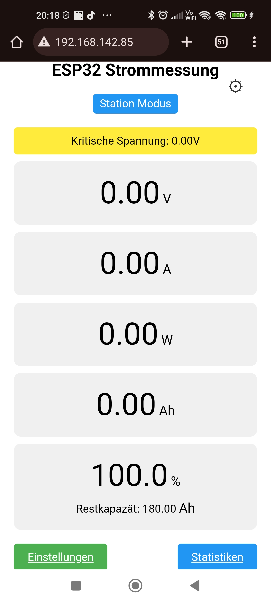
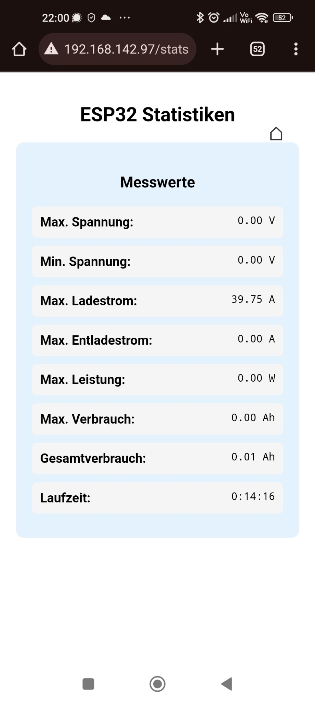

👉 [English version](README_EN.md)

👋 Hallo! Ich bin Eric (ericder92), ein begeisterter Bastler ohne professionelle Programmierkenntnisse.

⚡ Die Projekte hier – wie z. B. mein ESP32 Batterie-Monitor – sind reine Hobby-Basteleien.

Ich habe mir alles selbst beigebracht und teile meine Ergebnisse, damit andere davon profitieren oder mitbasteln können. 

💬 Mein Englisch ist nicht perfekt, und auch meine Programmierung ist eher "learning by doing" – aber mit viel Leidenschaft.

Alles, was du hier findest, darfst du gerne frei verwenden – nur bitte nicht kommerziell verkaufen.

🔧 Viel Spaß beim Mitbasteln!

# ESP32 Batterie-Monitor mit Webinterface

Dieses Projekt ist ein smarter Batterie-Monitor auf Basis eines ESP32 D1 Mini. Er misst in Echtzeit Spannung, Strom und die verbleibende Kapazität einer Batterie – ganz ohne Display oder mit Display. Die Bedienung und Anzeige erfolgt vollständig über eine Weboberfläche im lokalen Netzwerk.

## Features

- **Zwei ADS1115 (I2C)**:
  - Einer misst die Batteriespannung (über Spannungsteiler).
  - Der andere misst die Spannung über einen Shunt-Widerstand zur Strommessung.
- **I2C-Erkennung**:
  - Die Webseite gibt eine Warnung aus, wenn ein ADS1115 nicht erkannt wird.
- **Strom- und Spannungsmessung** in Echtzeit
- **Berechnung der verbleibenden Batteriekapazität**
- **Alle Parameter über die Weboberfläche einstellbar**:
  - Spannungsteiler-Verhältnis
  - Shunt-Widerstand (in mOhm)
  - Anfangskapazität der Batterie (z. B. 180Ah)
- **Unterspannungswarnung** bei Unterschreiten eines frei definierbaren Schwellenwerts
- **Webinterface statt Display**:
  - Darstellung und Konfiguration erfolgen per Browser
- **TFT-Display-Unterstützung (ST7796S)** (optional):
  - Anzeige der aktuellen Messdaten und der **IP-Adresse nach erfolgreicher WLAN-Verbindung**
- **Statistik und Systemüberblick**:
  - Maximal gemessene Spannung
  - Minimal gemessene Spannung
  - Maximaler Entlade- und Ladestrom
  - Aktuelle Leistung in Watt
  - Betriebszeit

## Hardware-Voraussetzungen

- ESP32 D1 Mini
- 2x ADS1115 ADCs (I2C)
- Shunt-Widerstand zur Strommessung
- Widerstände für den Spannungsteiler zur Spannungsmessung (z. B. 10 kΩ und 2 kΩ → Verhältnis 6)
- Batterie
- WLAN-Zugang (Router oder Hotspot)
- Optional: Display mit ST7796S-Chip

### I2C-Adressen & Verdrahtung der ADS1115

| ADDR-Pin verbunden mit | I2C-Adresse | Verwendung             |
|------------------------|-------------|------------------------|
| GND                    | `0x48`      | Strommessung (Shunt)   |
| SCL                    | `0x4B`      | Batteriespannung       |

Standardmäßige I2C-Pins am ESP32 D1 Mini:
- **SDA**: GPIO 21
- **SCL**: GPIO 22

Die ADS1115 messen im differentiellen Modus zwischen A0 und A1.

### Display-Anschluss (optional)

TFT-Display (ST7796S) – GPIOs im Code anpassbar:

- **TFT_CS**: GPIO 5  
- **TFT_RST**: GPIO 10  
- **TFT_DC**: GPIO 26

Das Display zeigt Live-Daten und die IP-Adresse nach erfolgreicher WLAN-Verbindung.

## Benötigte Bibliotheken

- `Wire.h`
- `SPI.h`
- `WiFi.h`
- `WebServer.h`
- `EEPROM.h`
- `Adafruit_ADS1X15.h`
- `Adafruit_ST7796S_kbv.h` *(optional)*

## Einrichtung

1. Sketch in Arduino IDE öffnen  
2. Bibliotheken installieren  
3. WLAN-Zugangsdaten eintragen  
4. Sketch auf ESP32 laden  
5. Serielle Konsole öffnen → IP notieren  
6. IP im Browser eingeben

## Webinterface

- Live-Daten: Spannung, Strom, Leistung, Restkapazität
- Konfiguration: Spannungsteiler, Shunt, Batteriekapazität, Unterspannungsschwelle
- Systemmeldungen (z. B. I2C-Fehler, Unterspannung)

## Beispiel-Webseiten

- Live-Ansicht:   
- Statistik:   
- Einstellungen: 

## To-Do / Ideen

- CSV-Export
- MQTT
- Datenspeicherung auf SPIFFS/SD
- Mobile-Optimierung

## Lizenz

MIT License – frei nutzbar. Bitte nicht kommerziell weiterverkaufen.  
Nennung von `@ericder92` willkommen!

Copyright (c) 2025 [ericder92](https://github.com/ericder92)
