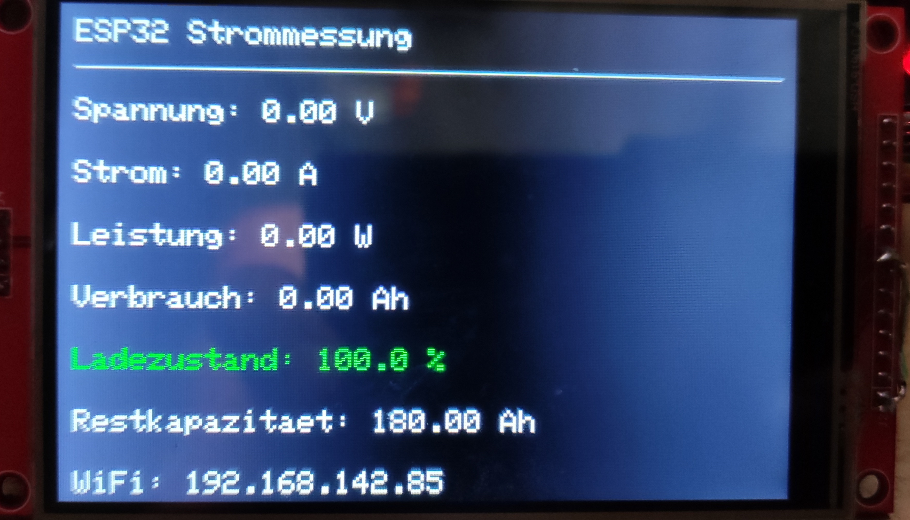

👋 Hi! I'm Eric (ericder92), a passionate tinkerer with no professional programming background.

⚡ The projects here – like my ESP32 Battery Monitor – are purely hobby creations.

I taught myself everything and share my work so others can learn from it or build their own versions.

💬 My English isn't perfect, and my programming is more "learning by doing" – but it's all made with enthusiasm.

You're welcome to use anything here freely – just please don’t sell it commercially.

🔧 Have fun tinkering!

# ESP32 Battery Monitor with Web Interface

This project is a smart battery monitor based on an ESP32 D1 Mini. It measures real-time voltage, current, and remaining battery capacity – either without a display or with a display. All control and visualization is done via a web interface over your local network.

## Features

- **Two ADS1115 modules (I2C):**
  - One measures battery voltage via a voltage divider.
  - The other measures voltage across a shunt resistor for current measurement.
- **I2C detection:**
  - The webpage displays a warning if an ADS1115 module isn't detected.
- **Real-time current and voltage monitoring**
- **Calculation of remaining battery capacity**
- **All parameters adjustable via the web interface:**
  - Voltage divider ratio
  - Shunt resistor value (in mOhms)
  - Initial battery capacity (e.g. 180Ah)
- **Low-voltage alert** if the voltage drops below a set threshold
- **Web interface instead of display:**
  - All data and settings available in your browser
- **Optional TFT display (ST7796S):**
  - Shows current measurements and the **IP address after Wi-Fi connection**
- **Statistics and system overview:**
  - Max measured voltage
  - Min measured voltage
  - Max discharge and charge current
  - Current power (W)
  - Total runtime

## Hardware Requirements

- ESP32 D1 Mini
- 2x ADS1115 ADCs (I2C)
- Shunt resistor for current measurement
- Resistors for voltage divider (e.g. 10kΩ and 2kΩ for ratio of 6)
- Battery
- Wi-Fi access (router or hotspot)
- Optional: TFT display with ST7796S chip

### I2C Addresses & Wiring of ADS1115 Modules

| ADDR pin connected to | I2C Address | Purpose              |
|-----------------------|-------------|----------------------|
| GND                   | `0x48`      | Current (shunt)      |
| SCL                   | `0x4B`      | Battery voltage      |

Default ESP32 D1 Mini I2C pins:
- **SDA**: GPIO 21
- **SCL**: GPIO 22

Both ADS1115s use differential mode and measure between inputs A0 and A1.

### Display Connection (Optional)

If using a TFT display (ST7796S), these are the default GPIO pins (can be changed in code):

- **TFT_CS**: GPIO 5  
- **TFT_RST**: GPIO 10  
- **TFT_DC**: GPIO 26

The display shows current values and the IP address after successful Wi-Fi connection.

## Required Libraries

- `Wire.h`
- `SPI.h`
- `WiFi.h`
- `WebServer.h`
- `EEPROM.h`
- `Adafruit_ADS1X15.h`
- `Adafruit_ST7796S_kbv.h` *(optional)*

## Setup Instructions

1. Open the sketch in Arduino IDE  
2. Install required libraries  
3. Enter your Wi-Fi credentials  
4. Upload the sketch  
5. Open the Serial Monitor → get IP address  
6. Enter the IP in your browser

## Web Interface

- Live data: voltage, current, power, capacity
- Settings: divider ratio, shunt, capacity, low-voltage limit
- System alerts (e.g. I2C error, low battery)

## Example Web Pages

- Live view:   
- Statistics:   
- Settings: 
- Display: 

## To-Do / Ideas

- CSV export
- MQTT support
- Save stats to SPIFFS or SD
- Mobile-friendly layout

## License

MIT License – open to all.  
Please do not resell. Attribution to `@ericder92` is appreciated!
